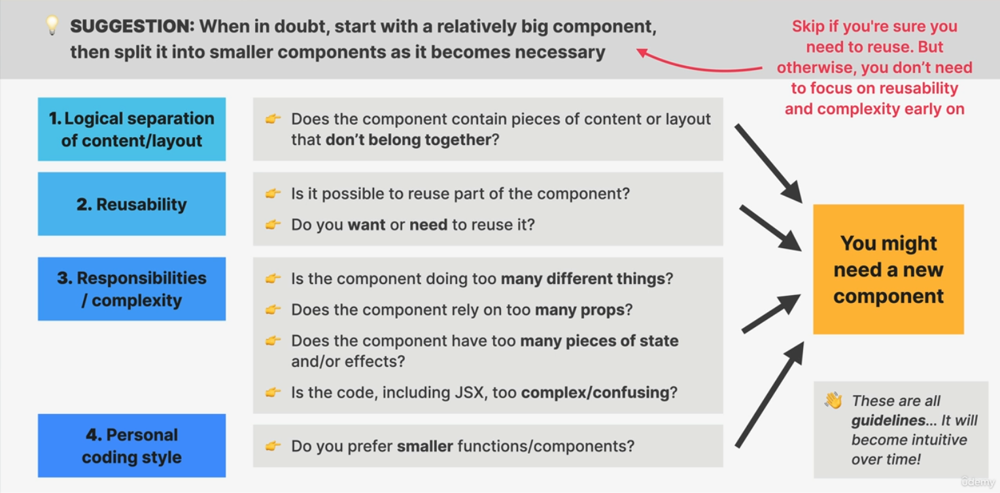
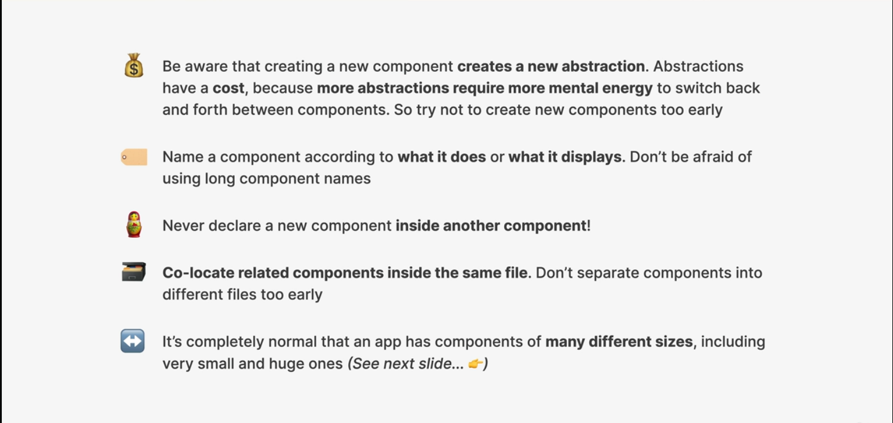
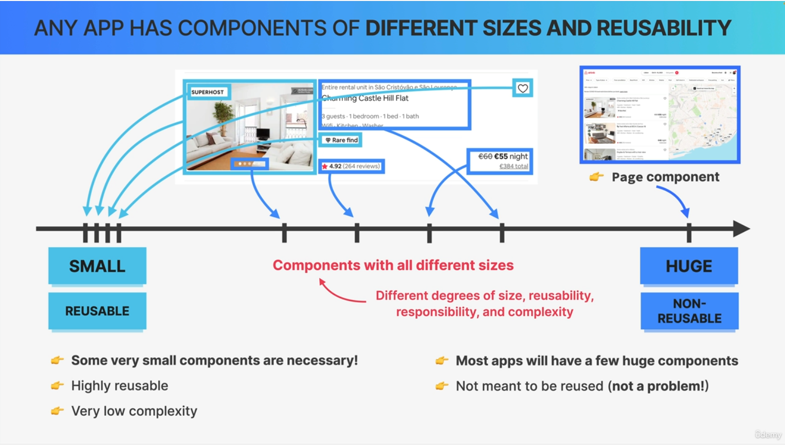
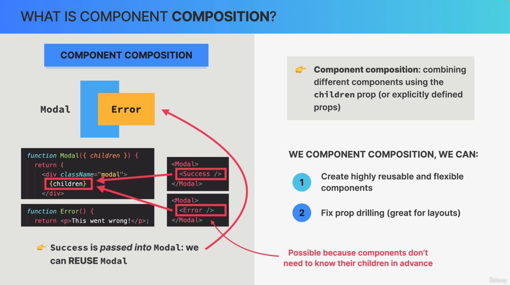

# Thinking in react components

## How to split a component

## When to creat new components

## General components guideline

## Different Size and Reusability

## What is component Composition

