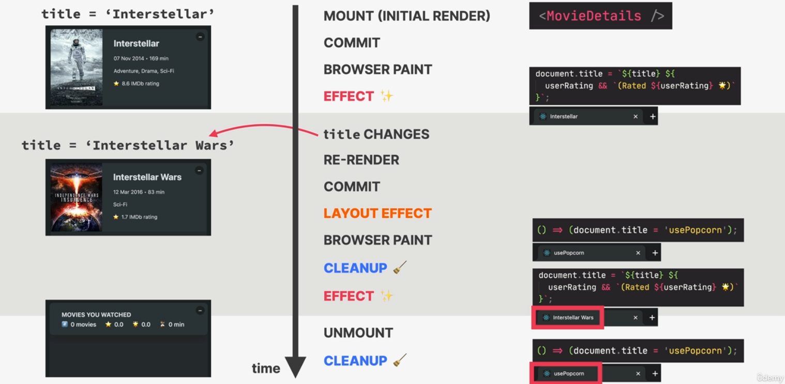
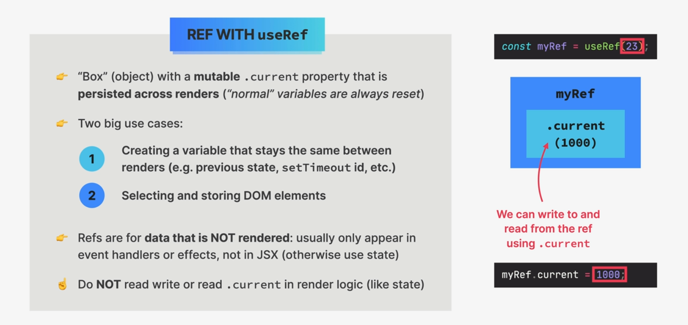
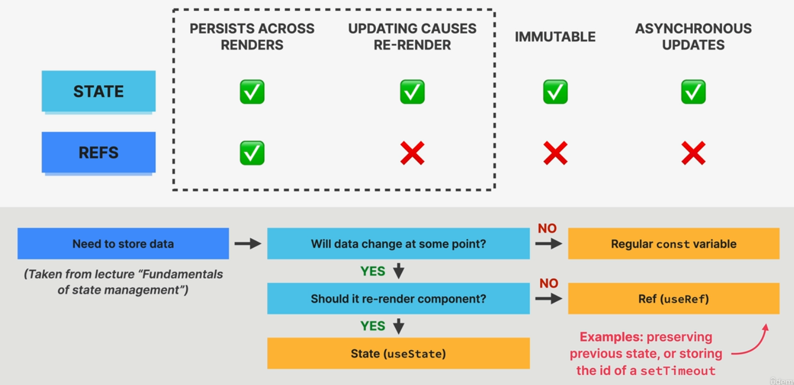
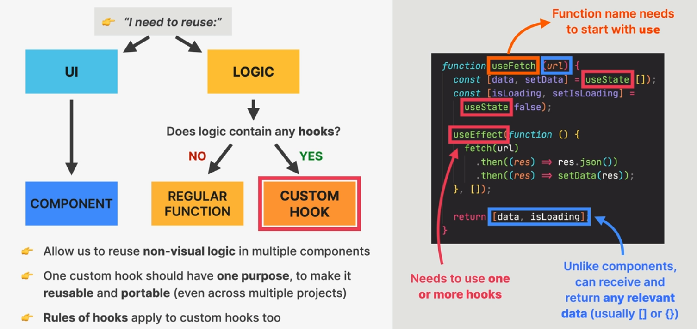

# Thinking in react components

## How to split a component


## When to creat new components


## General components guideline


## Different Size and Reusability


## What is component Composition


# Effect and Data Fetching

## Component lifecycle


## Event handler vs effect


## Dependency array


## useEffects synchronize mechanism


## Synchronization and lifeCycle


## When Effect are executed



## Effect synchronization

```js
useEffect(function () {
  console.log("initial render");
}, []);

useEffect(function () {
  console.log("after every render");
});

useEffect(
  function () {
    console.log("syncrhonized with query (prop/state)");
  },
  [query]
);
``;
```

## useEffect CleanUp function


### CleanUp data fetching with **Abort controler**

```js
useEffect(
  function () {
    const controller = new AbortController();
    async function fetchData() {
      try {
        setIsLoading(true);
        setError("");

        const response = await fetch(
          `https://www.omdbapi.com/?s=${query}&apikey=${KEY}`,
          { signal: controller.signal }
        );

        if (!response.ok) throw new Error("Error fetching movies");

        const data = await response.json();

        if (data.Response === "False") throw new Error("Movie not found");
        setMovies(data.Search);

        setError("");
      } catch (error) {
        if (error.name !== "AbortError") {
          setError(error.message);
        }
      } finally {
        setIsLoading(false);
      }
    }

    if (query.length < 2) {
      setMovies([]);
      setError("");

      return;
    }
    fetchData();

    return function () {
      controller.abort();
    };
  },
  [query]
);
```

# Hooks


## All built in hooks


## Rules of react hooks


### Hooks relay on call order


## Define-Update-state SUMMARY


## useRef



### useState vs UseRef



### Selecting dom element(useRef)

```js
useEffect(
  function () {
    function callback(e) {
      if (document.activeElement === inputEl.current) return;
      if (e.code === "Enter") {
        inputEl.current.focus();
        setQuery("");
      }
    }
    document.addEventListener("keydown", callback);
    return function () {
      document.removeEventListener("keydown", callback);
    };
  },
  [setQuery]
);

return (
  <input
    className="search"
    type="text"
    placeholder="Search movies..."
    value={query}
    onChange={(e) => setQuery(e.target.value)}
    ref={inputEl}
  />
);
```

### useRef to persist data between renders

- Do not trigger re-render
- Persist data between renders
- Mutable

```js
useEffect(
  function () {
    if (userRating) countRef.current = countRef.current + 1;
  },
  [userRating]
);
```

# Custome hooks


